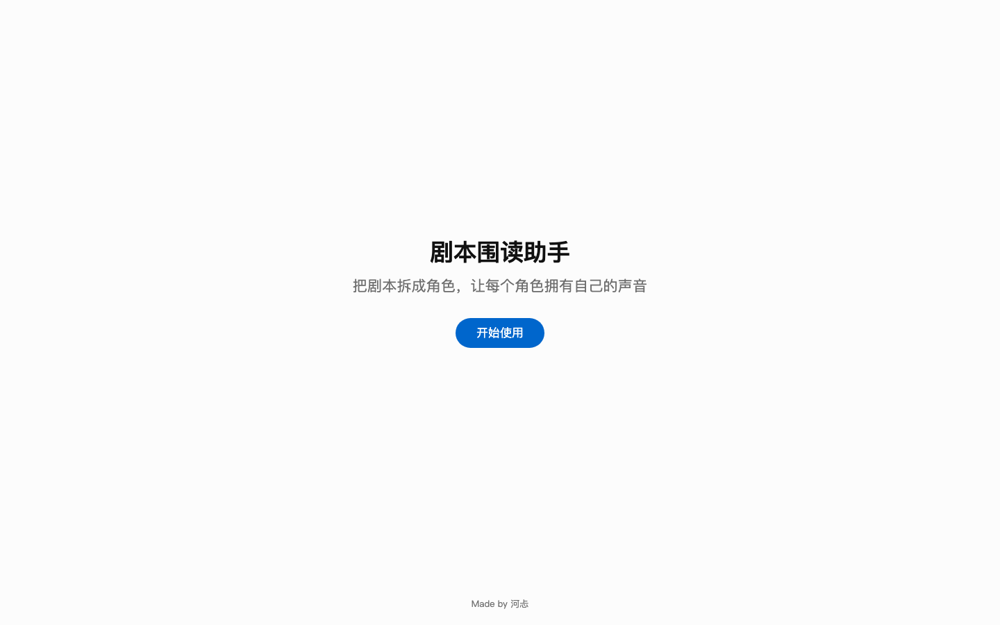
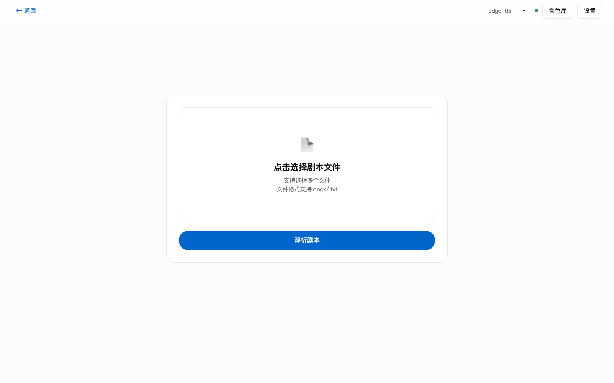
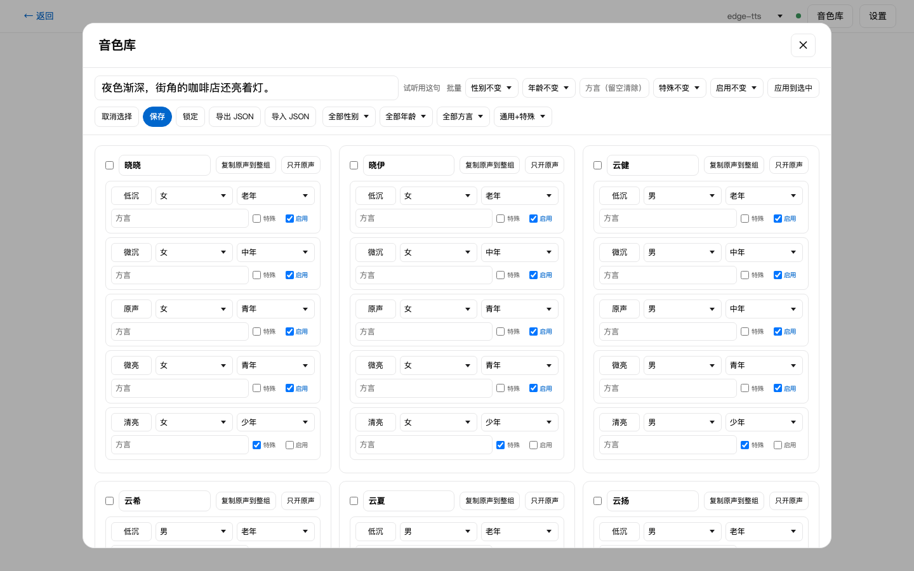

# 剧本围读

<p>
  
  
  
  
</p>

产品页：https://fotohet-1.github.io/TableReader/

上传剧本，自动拆出角色、预判性别和年龄段，按角色分配音色后分角色朗读。支持流式合成：满 25 句（或整剧不足 25 句时全部完成）即可提前进入围读，后台继续合成。

每次打开先进入“剧本围读助手”首页；首次使用会走两步引导（选择声音来源、选填 DeepSeek Key），之后进入选择页。选择页提供两条路：`上传新剧本` 进入上传流程，`继续围读` 进入存档选择页、选项目后直接进朗读页。上传页只保留上传卡片，音源切换和设置收在卡片下方；Qwen 模式下不显示音色库。

## 界面







## 功能

- 上传单个大文件，或一次多选文件夹里的多集剧本（.docx / .txt / .md），整体合并解析；集号从文件名提取（支持“第1集”“第一集”），按数字顺序排列，每集独立计场
- 行级解析：场标、对白、动作、旁白
- 场标识别支持“地点 时间 内/外”“内/外组合”、空镜、带括号注释等写法；解析后先出“场标预览”，疑似漏识别的场标会提示，可一键设为场标或忽略
- docx 上传时还会读取 Word 段落结构（加粗 + 前空行）作为疑似场标的补充信号，规则没认出的场标更容易被找出来
- 闪回镜头、“27A.”这类字母续拍段单独算场；INSERT 开头的插叙行不单独算场，按旁白并入当前场
- 角色写法归并（熊黑严肃 → 熊黑），规则预判性别，可选 DeepSeek 精修；角色按台词句数降序排列，每行显示句数
- 两条 TTS 路线：edge-tts 在线快速模式、本地 Qwen3 1.7B
- Qwen3 1.7B：VoiceDesign 用自然语言描述“设计”一次种子音色，之后用 Base 克隆固定，保证角色音色全剧统一；确认性别年龄后进入“声音设计”步骤，AI 生成描述、试听、人工调整
- 音色库：14 个中文基础音色 × 5 档语调 = 70 个独立音色位，每个档位可单独打性别、年龄、方言标签，支持试听、批量、导出/导入
- 围读播放：当前句高亮、自动滚动、0.5x-3x 倍速、±5s/±10s 跳转、进度条拖动
- 存档续读：合成时逐句把音频写到本地磁盘，围读中自动保存播放位置；换天、关浏览器后在选择页点“继续围读”，选存档即可接回上次位置

## 启动

### 从 GitHub 或外发包使用（其他 Mac 用户）

```bash
./setup.command      # 首次安装：装两个 Python venv + 下载 Qwen3 模型（约 4.5GB）
./start.command      # 以后每次：一键启动四个本地服务并打开浏览器
```

对方如果由 AI agent 代装，让它直接读 `AGENT_SETUP_RECIPIENT.md`。

从 GitHub 克隆后同样执行 `setup.command` 即可。仓库已自带 `dist/` 生产构建，普通用户不需要安装 Node；只有要改前端源码的开发模式才需要 `npm install && npm run dev`。

`start.command` 启动：前端静态服务 5174（直接用 `dist/` 构建产物，不需要 Node）、edge-tts 9882、Qwen3 9883、存档服务 9884。日志在 `logs/`，已运行的端口会自动跳过。

### 开发模式

```bash
npm install
npm run dev
```

浏览器打开 http://127.0.0.1:5174/

TTS 是本地 HTTP 服务，需要先启动其中一个：

- edge-tts（推荐，快）：`./.venv-edge/bin/python scripts/server_edge_tts.py`，地址 `http://127.0.0.1:9882`
- 本地 Qwen3 1.7B VoiceDesign（自然语言生成音色）：`./.venv-qwen/bin/python scripts/server_qwen_tts.py`，地址 `http://127.0.0.1:9883`
- 存档服务：`python3 scripts/server_archive.py`，地址 `http://127.0.0.1:9884`，不依赖外部网络

Qwen3 服务默认每种模型只保留 1 个实例以控制内存；内存充足时可用环境变量 `QWEN_DESIGN_POOL`、`QWEN_CLONE_POOL` 调大。
模型路径默认取仓库内 `models/`，也可用 `QWEN_VD_MODEL`、`QWEN_BASE_MODEL` 覆盖；生成超时用 `QWEN_JOB_TIMEOUT` 调整（默认 180 秒）。

服务地址和 DeepSeek Key 都只存在浏览器 localStorage，不会上传。

## 桌面 App 化（可选）

想让它在 Dock 有图标、窗口不带浏览器地址栏，用下面两步：

1. **无浏览器导航栏（PWA）**：在 Chrome 打开 `http://127.0.0.1:5174/`，点地址栏右侧的“安装”图标；或用 Safari 的「文件 → 添加到 Dock」。装完后是一个带图标、无地址栏的独立窗口。
2. **一键启动器**：运行 `bash scripts/make_app.sh` 生成 `TableReader.app`，双击它就会拉起四个本地服务并打开前端，可以当 `start.command` 的替代入口。

图标由 `scripts/gen_app_icons.py`（Pillow）生成，`.app` 是构建产物（已 gitignore）；换图标或换机器后重新跑 `make_app.sh` 即可。

## 存档与续读

- 整集完整音频自动生成：某集全部句子合成完成且零失败后，自动按播放时间轴拼出整集音频 `{工作区}/{剧集}/{集}/{剧名} {集名} 完整音频.wav`（同集同时说话会重叠），拼完围读页右上角角标显示“整集音频已生成”，点击可在访达中显示；继续围读旧集若还没拼过，角标会提示“可生成整集音频”。
- 存档目录 = 工作区，采用两级：`{工作区}/{剧集}/`。剧集下分 `音色/`（跨集音色库 + Qwen 种子）和各集，每集有自己的 `project.json`（剧本结构，只写一次）与 `meta.json`（音频 + 进度），合成音频落在 `{工作区}/{剧集}/{集}/audio/`
- 上传剧本自动识别剧名（`series.ts`），同名剧归到同一剧集，共用一套音色库。第二集解析到已在库里的角色时默认复用音色（edge 用库里 voiceId，Qwen 用库里 seed 直接克隆，不再重新生成），界面标“已复用”，可手动改后覆盖库，保证整部剧音色统一
- 角色名用 `roleBase`（剥头衔/OS/括注）作跨集身份键，`isPersona` 过滤“字幕/画面/内容”等非人描述行，避免幽灵角色进库
- 音源锁在剧级：同剧不同音源的复用会跳过，避免混用
- 工作区目录可在续读页或上传页“设置”里修改；换目录后“继续围读”先列剧集，再选某集接续播放
- 存档服务未启动时，合成会继续但音频不落盘；上传页会给出提示，不会静默失败

## 音色库

工作台顶部打开“音色库”，14 个中文基础音色各一张卡：

- 每张卡内 5 行，分别对应低沉/微沉/原声/微亮/清亮，每行可试听、可单独设置性别/年龄/方言
- 每行有“特殊”和“启用”两个标记：方言音色和少年档默认标为特殊，普通话常规音色为通用；“启用”决定这个音色是否进入下拉菜单和自动分配池
- 特殊音色默认只启用“原声”档（东北话、粤语各先放一个代表进池），需要更多档位时手动勾选启用，“只开原声”可一键收起整组
- 音色名在卡头统一修改，“复制原声到整组”可把原声档的标签铺到其他 4 档
- 勾选多张卡后，可用“批量”一次设置性别/年龄/方言/特殊/启用
- “导出 JSON”下载当前标签，“导入 JSON”合并回浏览器
- “保存”显式写回标签，“锁定”后音色库只读、防止误改，解锁后才能继续调整

标签存在浏览器 localStorage。分配角色音色时，下拉只显示已启用的音色，名称带“晓晓·低沉 · 女 · 老年”这类标签，并可先按性别/年龄/方言筛选。每个音色后面会显示当前持有它的角色数。

角色多时自动分配按分层走：先按角色性别年龄匹配标签（通用音色优先，特殊音色只在真有对应角色时用），再用通用音色池，最后才动特殊音色，全程只在“已启用”的音色里找。启用池不够用时，界面上会提示“可用音色不足”，你可以去音色库启用更多档位；合适的未占用音色用完后允许重复，但优先挑最合适的重复。

角色音色下拉旁有“试听”按钮，点一下就用当前选中的音色合成并播放试听句，再点一次停止。手动选择某个已被占用的音色时，数字变成 2，两个角色共享同一个声音，原占用者不会被踢走；想释放音色就把角色改成“未分配”。

多集剧本进入围读后按集顺序播放，场景标为“第一集 · 第一场”；朗读时只在每集开头读一次“第几集”，同集内各场只读“第几场”。

Qwen3 模式下，确认角色性别年龄后会先进入“声音设计”：每个角色有一段声音描述，可让 DeepSeek 根据角色台词自动生成（没有 Key 时用规则模板）；点“生成音色”用 VoiceDesign 生成一次种子音色并试听，满意后进入角色与音色。合成阶段用 Base 1.7B 以种子音色克隆固定，角色所有台词共用同一音色。

## 命令

```bash
npm run typecheck   # TypeScript 检查
npm run build       # tsc 检查 + 生产构建
npm run preview     # 预览构建产物
```

`scripts/e2e-check.mjs` 是浏览器端全流程检查脚本，需要 dev server 和一个带远程调试端口（默认 9223）的 Chrome。

## 结构

```text
src/lib/        解析、角色、音色、LLM、流式合成、TTS 适配
src/pages/      工作台与围读播放页
src/components/ 播放条
scripts/        浏览器端检查脚本
```
